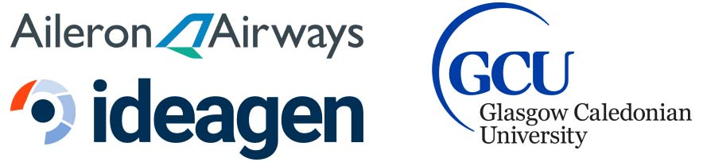

# Aileron Airways #

This project is a timeline management tool for tracking and logging risk for a fictional airline, Aileron Aiways. This project was developed in conjunction with Ideagen PLC as part of a University project at Glasgow Caledonian University.



# Team Members
Below are the current team members

|Team Member | Email Address|
| --- | ---: |
|*Christopher Connor*|	█████████@caledonian.ac.uk|
|Iain Craig |	█████████@caledonian.ac.uk|
|[Catriona Crowe](https://github.com/catcro) |	██████████@caledonian.ac.uk|
|[Matthew Hederly](https://github.com/MattHedderly) |	█████████@caledonian.ac.uk|
|[Scott McLaughlan](https://github.com/scottevo) |	█████████@caledonian.ac.uk|

# How to run?

To run this project, you must have node installed as this will manage the dependencies.

From the root of the application, run the following

```
npm install
```

Once this has updated, you can now launch the application by typing the following

```
ng serve
```

The application will now be available locally. The default location is `http://localhost:4200`

# Issues?

If you are having issues running this, please contact cconno208@caledonian.ac.uk
